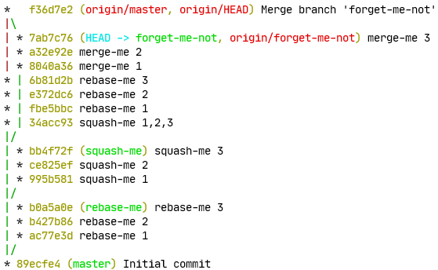
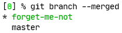
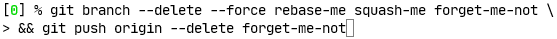
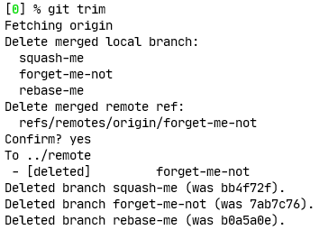
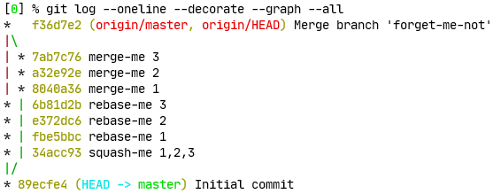
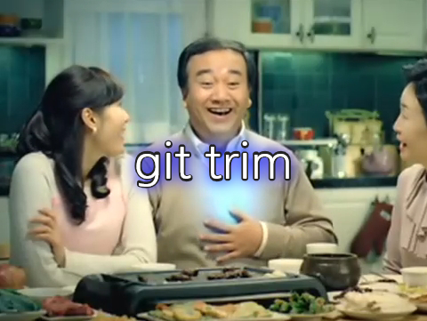

[](https://github.com/foriequal0/git-trim/actions?query=workflow%3ACI) [](https://crates.io/crates/git-trim)

git-trim
========


`git-trim` automatically trims your branches whose tracking remote refs are merged or gone

[Instruction](#instruction) | [Configurations](#configurations) | [FAQ](#faq)

## Instruction

### Installation
Download binary from [Releases](https://github.com/foriequal0/git-trim/releases), and put it under your `PATH` directories.

You can also install with `cargo install git-trim` if you have `cargo`.

It uses [`git2`](https://crates.io/crates/git2) under the hood which depends conditionally on [`openssl-sys`](https://crates.io/crates/openssl) on *nix platform.
You might need to install `libssl-dev` and `pkg-config` packages if you build from the source. See: https://docs.rs/openssl/0.10.28/openssl/#automatic

### How to use
1. Don't forget to set an upstream for a branch that you want to trim automatically.
   `git push -u <remote> <branch>` will set an upstream for you on push.
1. Run `git trim` if you need to trim branches especially after PR reviews. It'll automatically recognize merged or gone branches, and delete it.
1. If you need more power, try `git trim --delete all`
1. You can also `git trim --dry-run` when you don't trust me.

## Why have you made this? Show me how it works.

### Git's PR workflow is a little bit tedious as a routine.
There are so many lines of commands to type and many statuses of branches that corresponding to PRs that you've sent.
Were they merged or rejected? Did I forget to delete the remote branch after it is merged?

After some working with the repository, you'll execute `git fetch --prune` or `git remote update --prune` occasionally. However, you'll likely see the mess of local branches that are already merged and removed on the remote. Because `git fetch --prune` only deletes `refs/remotes/<remote>/<branch>` but not corresponding `refs/heads/<branch>` for you. It is worse if remote branches that are merged but the maintainer forgot to delete them, the `refs/remotes/<remote>/<branch>` would not be removed and so on even if you know that it is merged into the master.



They are tedious to remove manually. `git branch --merged`'ll likely to betray you when branches are rebase merged or squash merged.



After the PR is merged or rejected, you're likely to delete them manually if you don't have `git-trim` but it is tedious to type and error-prone.



You repeat these same commands as much as PRs that you've sent.
You have to remember what branch is for the PR that just have been closed and it is easy to make a mistake.
I feel nervous whenever I put `--force` flag. Rebase merge forces to me to use `--force` (no pun is intended).
`git reflog` is a fun command to play with, isn't it? Also `git remote update` and `git push` is not instantaneous.
I hate to wait for the prompt even it is a fraction of a second when I have multiple commands to type.


### Why don't you just use `git fetch --prune` or `git <bash oneliner HERE> | xargs git branch -D`

See [FAQ](#faq)

### See how `git-trim` works!

It is enough to type just `git trim` and hit the `y` key once.



Voila!



That's why I've made `git-trim`.
It knows whether a branch is merged into the default base branch, or whether it is rejected.
It can even `push --delete` when you forgot to delete the remote branch if needed.



## Configurations

### `git config trim.bases`

Comma seperated multiple names of branches. All the other branches are compared with those branch's remote reference.
Base branches are never be deleted.

The default value is `develop,master`.

You can override it with CLI option `--base develop --base master` or `--bases develop,master`

### `git config trim.protected`

Comma seperated multiple glob patterns (e.g. `release-*`, `feature/*`) of branches or local/remote references that should never be deleted.
You don't have to put bases to the `trim.protected` since they are never be deleted by default.

The default value is ``.

You can override it with CLI option with `--protected release-*`

### `git config trim.delete`

Comma separated values of `<filter unit>[:<remote name>]`.
Filter unit is one of the `all`, `merged`, `gone`, `local`, `remote`, `merged-local`, `merged-remote`, `gone-local`, `gone-remote`.
`all` implies `merged-local,merged-remote,gone-local,gone-remote`.
`merged` implies `merged-local,merged-remote`.
`gone` implies `gone-local,gone-remote`.
`local` implies `merged-local,gone-local`.
`remote` implies `merged-remote,gone-remote`.

You can scope a filter unit to specific remote `:<remote name>` to a `filter unit`
if the filter unit implies `merged-remote` or `gone-remote`.
If there are filter units that is scoped, it trims merged or gone remote branches in the specified remote branch.
If there are any filter unit that isn't scoped, it trims all merged or gone remote branches.

The default value is `merged`.

You can override it with CLI flag with `--delete local`

### `git config trim.update`

A boolean value. `git-trim` will automatically call `git remote update --prune` if it is true.

The default value is `true`.

You can override it with CLI flag with `--update` or `--no-update`.

### `git config trim.confirm`

A boolean value. `git-trim` will require you to put 'y/n' before destructive actions.

The default value is `true`.

You can override it with CLI flag with `--confirm` or `--no-confirm`.

### `git config trim.detach`

A boolean value. `git-trim` will let the local repo in the detached HEAD state when it is true and the current branch will be deleted.

The default value is `true`.

You can override it with CLI flag with `--detach` or `--no-detach`.

## FAQ

### What is different to `git fetch --prune`?

git fetch --prune only deletes remote refs (`refs/remotes/...`) that deleted from the remotes.

It doesn't touch local branches that track the remote refs even if the remote refs are merged into the branch and deleted by somehow. You should manually delete corresponding local branches in that case. If you use rebase merge, you might have to use scary `--force` flag such as git branch --delete --force feature.

`git-trim` does detect whether the corresponding branches are merged into the base remote branch. It knows whether it is safe to delete, and even knows that you forgot to clean the branch in the remote after merge.

### What is different to `<bash one-liner HERE> | xargs git branch -D`

Just deleting a branch that tracking remote is gone with `-D`, which implies `--force`, needs an extra caution since it might delete contents that are not fully merged into the base or modified after being merged. It not because `--force` is dangerous. Just `gone` doesn't mean it is fully merged to the base. So I gave it a steroid.

 * It inspects branches whether they are 'fully' merged, not just whether their tracking branch is gone. About half of the code is the common git scenario tests. I wanted to make sure that it doesn't delete unmerged contents accidentally in any case.
 * It supports github flow (master-feature tiered branch strategy), git flow (master-develop-feature tiered branch strategy), and simple workflow (with a remote repo and local clone), and triangular workflow (with two remote repos and one local clone).
 * It is a merge styles agnostic. It can detect common merge styles such as merge with a merge commit, rebase/ff merge, squash merge.
 * It can also inspect remote refs so it deletes remotes in case you forgot to delete the remotes.
 * Moreover, it runs in parallel. Otherwise, large repos with hundreds of stale branches would have took a couple of minutes to inspect whether they are merged.

### What kind of merge styles that `git-trim` support?

* A classic merge with a merge commit with `git merge --no-ff`
* A rebase merge with `git merge --ff-only`
* A squash merge with `git merge --squash` (With this method: https://stackoverflow.com/a/56026209)

### What is the difference between the `merged` and `gone` branch?

A merged branch is a branch that you can safely remove them.
It is already merged into the base branch, so you're not going to lose the changes.

However, your PRs are sometimes rejected and deleted from the remote.
Or you might forget the fact that the PR is merged.
So you might have been mistakenly amended or rebased the branch and the patch is now completely different from the patch that is merged.
Then it is `gone`, which means that you might lose your changes. The term is borrowed from the git's remote tracking states.

### I'm even more lazy to type `git trim`

Try this `post-merge` hook. It automatically calls `git trim --no-update` everytime you `git pull` on `master` or `develop`. `git config fetch.prune true` is recommended with this hook.
```shell
#!/bin/bash
BRANCH=$(git rev-parse --abbrev-ref HEAD)
case "$HEAD_BRANCH" in
    "master"|"develop") ;;
    *) exit ;;
esac

git trim --no-update
```

## Disclaimers
Git and the Git logo are either registered trademarks or trademarks of Software Freedom Conservancy, Inc., corporate home of the Git Project, in the United States and/or other countries.

The logo is a derivative work of [Git Logo](https://git-scm.com/downloads/logos). Git Logo by [Jason Long](https://twitter.com/jasonlong) is licensed under the [Creative Commons Attribution 3.0 Unported License](https://creativecommons.org/licenses/by/3.0/). The logo uses Bitstream Charter.

Images of a man with heartburn are generated with [https://gvsc.rajephon.dev](https://gvsc.rajephon.dev)
